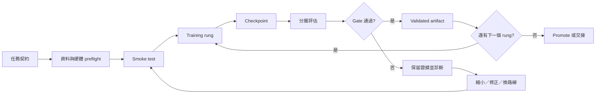

# LLM Training Operations Skill

> 把「模型有跑起來」變成「模型可驗證、可恢復、可交接、可持續前進」。

這是一套給長時間模型訓練使用的作業方法與 Codex Skill。它不只關心某一次訓練的 loss 有沒有下降，而是把整個研究與工程流程固定下來：從資料、硬體、smoke test、checkpoint、評估、升級／回退，到跨小時跨天的自動排程與安全交接，都留下可追溯證據。

它適合拿來訓練或微調：

- SFT、LoRA、蒸餾、分類器、ranker、seq2seq 與領域專家模型
- OCR／VLM／文件理解／結構化抽取模型
- 剪枝、量化、模型手術與壓縮實驗
- 必須在本機、私有節點或有限 GPU 上長時間執行的研究工作
- 需要讓下一個人、下一個 session 或下一台機器接手的模型專案

本 repo 的重點不是提供一個「神奇的 train.py」，而是提供一個能長期信任的訓練作業系統：你可以替換自己的 trainer、模型、資料和硬體，但不必重新發明如何記錄、驗證、恢復與交接。

## 目錄

- [為什麼需要它](#為什麼需要它)
- [核心承諾](#核心承諾)
- [最新基準：Bragi Asclepius × ISEEU](#最新基準bragi-asclepius--iseeu)
- [快速開始](#快速開始)
- [完整工作流](#完整工作流)
- [Run 目錄與資料契約](#run-目錄與資料契約)
- [評估與 promotion 規則](#評估與-promotion-規則)
- [外部框架與 MLOps 整合](#外部框架與-mlops-整合)
- [持續訓練與自動排程](#持續訓練與自動排程)
- [Teacher／Student 交接](#teacherstudent-交接)
- [常見失敗與處理方式](#常見失敗與處理方式)
- [內建腳本](#內建腳本)
- [如何在 Codex 中使用](#如何在-codex-中使用)
- [參考資料與來源方法](#參考資料與來源方法)
- [貢獻與延伸](#貢獻與延伸)

## 為什麼需要它

模型訓練最危險的時刻，通常不是程式立刻報錯，而是「看起來成功」：

- loss 下降了，但真實資料完全沒有變好。
- synthetic validation 很漂亮，real holdout 卻崩潰。
- wrapper／規則／cache 把分數墊高，最後被誤報成模型本身能力。
- 單次 seed 或單個 checkpoint 剛好最好，換機器或重跑就消失。
- 訓練跑了十幾個小時，卻沒有可載入的 checkpoint、資料 hash 或 evaluator 證據。
- 夜間工作被中斷後，只剩一個模糊的「上次好像跑到 epoch 8」。
- 老師模型、學生模型和 runtime 各自報一套數字，沒有人知道真正改善的是哪一層。

這個 Skill 的做法是把訓練拆成可觀測的決策節點：



## 核心承諾

### 1. 把能力分層，不混淆成果

至少分開記錄：

1. 模型權重本身。
2. 模型手術，例如剪枝、量化、RMSNorm 調整。
3. 推論 runtime，例如 tokenizer、decoder、validator、ranker、policy。
4. 外部工具、規則、cache 與產品流程。

`runtime 92%`、`OCR-visible 100%`、`synthetic valid 83%` 和 `真實照片 exact 27%` 是不同層級的數字，不能放進同一欄，也不能用包裝層成果冒充裸模型能力。

### 2. 每一輪都有完整證據

一個可驗收的 run 至少要知道：

- run id、任務、方法、base model、seed
- train／valid／hard／realistic／sealed holdout 的資料來源與 fingerprint
- config hash、vocab hash、程式或 git 版本
- 實際 device、硬體與 runtime，而不是「預期會用 GPU」
- checkpoint、eval report、artifact 路徑與 SHA-256
- 成功、失敗、阻塞、回退與下一步的原因

缺少這些資料時，它仍然可以是探索性實驗，但不能叫做 validated release。

### 3. loss 下降不是成功條件

loss 只能回答最佳化器正在依照目標函數前進，不能直接回答產品任務有沒有變好。每個重要 checkpoint 都要跑獨立 validation 或小型真實 eval；最後能否 promote，取決於預先寫好的 gate 與產品回歸。

### 4. 不中斷不等於盲目一直跑

持續工作代表：狀態可讀、工作可排隊、資源有鎖、checkpoint 可恢復、錯誤可重試、阻塞可標記、下一個安全工作能接續。它不代表為了讓 queue 看起來忙碌，就跳過 gate、猜測缺失資料或搶占正在服務的 GPU。

## 最新基準：Bragi Asclepius × ISEEU

這個 repo 的最新工作基準來自 Bragi Asclepius 主線；實際訓練目標仍然是 ISEEU。兩者的關係是：

```text
Bragi Asclepius：最新的研究方法、證據紀律、長跑與自動接棒方式
                         │
                         ▼
ISEEU：實際要訓練、評測、部署的名片 OCR 模型
```

這個邊界很重要：Bragi 的 coding model、量化或模型手術結果，不會被寫成 ISEEU 成果；ISEEU 的 detector、line recognizer、欄位 pack 和 App gate 也必須各自量測。

目前最新可核對的 ISEEU v6 candidate：

| 項目 | 已核對狀態 |
| --- | --- |
| 方法 | CTC line recognizer，從零訓練 |
| 裝置 | MPS |
| train / valid | 96,409 / 9,951 rows |
| 字表 / 參數 | 2,613 chars / 1,407,350 params |
| checkpoint | `artifacts/recog-v6.pt`，已落地 epoch 12 |
| model-only valid | exact 67.9228%，CER 0.116795 |
| 產品 gate | 尚未完成，不能宣稱已贏 Apple 或可出貨 |
| 續訓 | `v6-cont-20260919` 仍需 preflight、fingerprint、smoke |

它示範了本 Skill 的核心分寸：checkpoint 已存在，就報 checkpoint；epoch 13 只有 partial batch log，就報 partial；沒有 real-card product eval，就明確寫 pending。這種分層報告比一個漂亮但不可追溯的「完成」更有價值。

Bragi Asclepius 主線反覆驗證的工作循環是：

1. 先讀正本路徑、程式和目前 artifact，不靠 session 記憶猜狀態。
2. 先跑 preflight 與 smoke，讓第一個 checkpoint 在短時間內可載入、可評估。
3. 長跑期間持續寫 log、heartbeat、checkpoint 與狀態檔；watcher 不只看 PID。
4. 對每個漂亮結果主動找反證，尤其要用 real／hard／sealed 資料重算。
5. 發現資料分布或評估尺錯了，先修假設與 evaluator，再決定是否繼續燒算力。
6. 一輪結束後以 `continue`、`pivot`、`reject` 或 `blocked` 接棒，不讓 session 的結束等於工作的結束。

詳細的最新主線、ISEEU v6 路徑與證據邊界，請讀 [`references/bragi-asclepius-latest.md`](references/bragi-asclepius-latest.md)。

## 快速開始

### 安裝到 Codex

在要使用這個 Skill 的環境中，將 repository clone 到 Codex skills 目錄：

```bash
SKILLS_DIR="${CODEX_HOME:-$HOME/.codex}/skills"
git clone https://github.com/norika1207-lab/LLM-Training-Skill.git \
  "$SKILLS_DIR/mercury-model-training-ops"
```

如果該目錄已經存在，請先用 `git pull` 更新，或把 repository 內容同步到既有 Skill 目錄。這個 repo 的 Skill 入口是根目錄的 `SKILL.md`。

### 建立第一個可恢復的 run

內建腳本只使用 Python standard library，不需要額外 pip 套件：

```bash
cd LLM-Training-Skill

python3 scripts/scaffold_run.py runs/receipt-sft-001 \
  --task "receipt line recognition" \
  --method "sft" \
  --base-model "your-base-model" \
  --device "cuda:0" \
  --seed 17
```

這會建立：

```text
runs/receipt-sft-001/
├── config.json
├── manifest.json
├── queue.jsonl
├── STATUS.md
├── NEXT_ACTIONS.md
├── checkpoints/
├── data/
├── eval/
├── artifacts/
├── failure-bank/
├── locks/
└── logs/
```

接著把自己的資料 manifest、preflight 結果、trainer、log、checkpoint 和 eval report 放進這個 run；完成某個階段後執行：

```bash
python3 scripts/validate_training_run.py runs/receipt-sft-001
```

驗證器檢查的是「作業結構是否完整」，不是替你宣稱模型品質。它會提醒缺少 checkpoint、eval 或 artifact，也會指出 dataset fingerprint 與 vocab hash 是否仍是 `pending`。

### 最小可行 prompt

如果你使用 Codex，可以直接把以下內容貼給它：

```text
請依照 mercury-model-training-ops Skill 執行這個模型訓練任務：

任務：<清楚描述輸入、輸出與產品用途>
模型／方法：<base model、SFT／LoRA／蒸餾／分類器等>
資料：<train、valid、hard、realistic、sealed holdout 的位置>
硬體：<CPU、MPS、CUDA、遠端節點與可用資源>
成功 gate：<主要指標、最大回歸、延遲／大小限制>
停止條件：<什麼情況必須停止、回退或換路線>

要求：先做 preflight 與 smoke，再逐級訓練；每個 rung 都要留下 checkpoint、eval、hash 與 STATUS；不要把 runtime 或 synthetic 成果報成模型能力；長跑要可 resume，並在每輪結束回報下一步與 blocker。
```

## 完整工作流

### 0. 先寫任務契約

訓練開始前先回答：

- 這次要保留什麼能力、補什麼能力？
- 輸入和輸出 schema 是什麼？哪些欄位可以是 null？
- 哪些層 trainable，哪些層 frozen？
- 基準模型與 sealed holdout 是什麼？
- 模型大小、延遲、記憶體和硬體限制是什麼？
- 最低 valid gate、產品 gate、最大可接受回歸是多少？
- 什麼條件下繼續、縮小、回退、換資料或換模型？

把「研究 prototype」「可重跑 artifact」「可部署 runtime」「可公開產品」分成四種狀態。不要讓 prototype 的數字在沒有補證據前直接升格成產品宣稱。

### 1. 資料 preflight

先統計並固定：

- rows／pages／images 與每個 split 的數量
- schema 欄位、空值、重複、錯誤格式與無效樣本
- train／valid／test／sealed 的切分規則
- 來源、標註者、teacher、可見性與品質等級
- hard cases、failure bank、needs-review 的保存位置
- dataset fingerprint 與排除規則

對 OCR、VLM、文件理解任務，特別檢查：

- synthetic 和 real 是否分開報告
- teacher 產出的標註是否可能把錯誤或 template 帶進學生資料
- train 與 holdout 是否有圖片、文字、template 或近似內容 leakage
- evaluator 量的是「真實文字正確率」、「上游可見 coverage」還是「衍生欄位正確率」
- Apple／Tesseract／VLM 等外部工具是不是只提供 noisy reference，而非 ground truth

### 2. 硬體與 runtime preflight

開始前實際確認：

- CPU／MPS／CUDA／VLM endpoint 到底是哪一個在工作
- `torch.cuda.is_available()`、MPS、GPU memory、RAM、磁碟是否足夠
- Python、torch、driver、CUDA、遠端節點與 SSH 是否可用
- 是否已有舊 server、舊 process、GPU lock 或服務佔用資源
- 輸出目錄是否可寫、checkpoint 是否有足夠空間

「機器有 GPU」不等於「訓練真的使用 GPU」。當 GPU utilization 是 0，或實際 fallback 到 CPU 時，要如實記在 preflight 與 STATUS，不要把預期硬體寫成實際硬體。

### 3. Smoke test 與 training rung

建議用階梯放大，而不是第一次就把全部資料與最大容量丟進黑箱：

```text
64–256 rows → 1k–8k balanced subset → full dataset → target capacity
```

每一級先確認：資料能讀、vocab／tokenizer 穩定、第一個 batch 有輸出、forward／backward 成功、checkpoint 可載入、valid 可跑、metadata 沒有錯位。

Smoke test 的目標是證明管線可工作，不是宣稱準確率。只要能形成第一個可載入並可評估的 checkpoint，才有資格放大資料、序列長度、hidden size 或 epoch。

### 4. 可觀測長跑

每個長跑都應該持續寫入：

```json
{
  "run_id": "receipt-sft-001",
  "state": "running",
  "host": "training-node-a",
  "device": "cuda:0",
  "epoch": 3,
  "batch": 420,
  "loss": 0.8421,
  "learning_rate": 0.00002,
  "last_checkpoint": "checkpoints/step-400.pt",
  "last_heartbeat": "2026-09-19T12:00:00Z",
  "error": null
}
```

實作上可以用 `progress.json` 或 append-only JSONL。重要的是狀態不能只存在終端畫面：

- 每 N batch 或每個安全節點寫 checkpoint。
- stdout／stderr 持續寫到 `logs/`。
- checkpoint 先寫 temporary file，再 atomic rename。
- sidecar 記錄資料 fingerprint、vocab hash、config hash、程式版本、device 與硬體。
- 一張 GPU 一個 lock；VLM、full-grid、SFT 等重工作透過 queue 安全串行或並行。

若數分鐘沒有 epoch，不要直接假設卡死，也不要只靠「再等等」。先看 PID、CPU／GPU、RSS、磁碟寫入、最後 checkpoint 和 stdout；超過該配置合理門檻仍無進度時才停止，並保留 partial artifact 與診斷原因。

### 5. Checkpoint 不只是備份，也是決策點

每個 checkpoint 至少保存：

- model weights 或 adapter
- optimizer state、scheduler state、global step、epoch
- tokenizer／vocab 與 config
- dataset fingerprint、seed、device、程式版本
- training metrics、valid metrics 與 evaluator 版本
- 是否為 best、last、milestone 或 rejected checkpoint

保留 `best` 與 `last`，並保留足夠的中間點看曲線。只留下單一 best 會造成選擇偏差，也會讓你無法回答「什麼時候開始過擬合」或「valid 改善但任務指標下降了嗎」。

### 6. 分層評估

至少分成四層：

| 層級 | 要回答的問題 | 不可混成什麼 |
| --- | --- | --- |
| `model-only` | 固定輸入下，裸模型學到什麼？ | 不可含 runtime 修補 |
| `runtime` | tokenizer、decoder、validator、ranker 接起來後怎樣？ | 不可叫裸模型分數 |
| `distribution` | real、hard、跨版型、跨語言、跨設備是否穩？ | 不可只報 easy subset |
| `product gate` | 完整產品流程是否可用？ | 不可用 cache-hit 代替失敗 |

每層都記錄分母、樣本數、exact、CER／task metric、valid JSON、latency、cache 命中與失敗原因。

### 7. Promote 或回退

採用明確狀態流：

```text
candidate → validated → promoted
                 ↘ rejected
```

通過 gate 後才建立 immutable release manifest，包含 artifact 路徑、大小、SHA-256、資料／config／vocab hash、基準差異、已知限制、可重跑命令與下一步。新版本回歸時保留 rejected artifact，active 版本回到上一個 validated 版本；不要原地覆蓋上一個安全版本。

## Run 目錄與資料契約

`scaffold_run.py` 會建立一個非破壞性的 run skeleton：

```text
run-dir/
├── config.json          # 任務、方法、base model、device、seed
├── manifest.json        # dataset、hash、gate、checkpoint policy、狀態
├── queue.jsonl          # append-only 狀態事件
├── STATUS.md            # 給人與下一個 session 讀的現況
├── NEXT_ACTIONS.md      # 下一個可執行步驟與 blocker
├── checkpoints/         # 可載入的中間與候選版本
├── data/                # manifest、split、fingerprint、樣本索引
├── eval/                # evaluator output、summary、failure analysis
├── artifacts/           # candidate／validated／promoted release
├── logs/                # stdout、stderr、watchdog、報告
├── locks/               # 資源鎖與 owner metadata
└── failure-bank/        # hard case、錯誤樣本、needs-review
```

`manifest.json` 的最小概念如下：

```json
{
  "run_id": "receipt-sft-001",
  "task": "receipt line recognition",
  "method": "sft",
  "base_model": "your-base-model",
  "dataset": {
    "train_rows": 12000,
    "valid_rows": 800,
    "sealed_rows": 400,
    "fingerprint": "sha256:..."
  },
  "config_hash": "sha256:...",
  "vocab_hash": "sha256:...",
  "seed": 17,
  "device": "cuda:0",
  "checkpoint_policy": {
    "every_batches": 20,
    "keep_best": 3
  },
  "gates": {
    "valid_metric": "exact >= baseline + 0.03",
    "product_metric": "sealed_no_regression",
    "max_regression": 0.01
  },
  "status": "queued"
}
```

不要把 `pending` 長期留在正式 release。dataset fingerprint、vocab hash、eval report、artifact hash 未完成時，狀態應該停在研究或候選階段。

## 評估與 promotion 規則

### 多 seed 與預先註冊規則

單次跑得比較高，不代表模型真的比較好。重要比較至少使用 3 個 seed，報告 median、全距或 confidence interval；不要在看到結果後才改門檻。

```text
固定資料 + 固定 evaluator + 固定設定
        ↓
seed 17 / seed 23 / seed 41
        ↓
median、range、每個 seed 的 raw result
        ↓
依事前 gate 決定 promote、tie、reject
```

若兩個模型的結果區間大量重疊，應該說「目前無法區分」，而不是把單次 +4% 寫成穩定提升。即使品質打平，較快、較小、較省記憶體仍可能是有效改善，但要分開寫成效率成果。

### 真實資料優先於漂亮的 proxy

synthetic、teacher label、OCR-visible、Apple／Tesseract 參考答案都可能有用，但不一定是真實 ground truth。報告中要明確寫：

- 這個分數的分母是什麼？
- 標註是否可能漏行、漏欄位或帶有 template？
- 是模型能力、上游 coverage、衍生欄位，還是 runtime 結果？
- holdout 是否完全未參與訓練、調參與選 checkpoint？

若 `tax_total = tax_8 + tax_10` 這類欄位可以由其他欄位推導，必須分開報「模型直接讀到的正確率」與「產品經推導後的正確率」。

### 硬案例與失敗銀行

當模型在簡單資料改善、在真實資料退化時，不要直接加 epoch。先把 failure bank 分成：

- detector／segmentation 失敗
- recognizer 失敗
- teacher label 失敗
- tokenizer／vocab 失敗
- decoder／schema／validator 失敗
- 資料 domain mismatch
- 硬體或 runtime fallback

只有確認是哪一層的問題，下一輪才有意義。

## 持續訓練與自動排程

### Durable queue

長跑工作使用持久化 queue，而不是一個不可觀測的背景 shell。推薦狀態：

```text
queued → running → checkpointed → evaluating → promoted
    ↘ blocked                         ↘ rejected
```

每個 job 至少要有：

- job id、run dir、task、method、input／output
- device、GPU／RAM／磁碟需求
- retry 次數、最後 heartbeat、最後 checkpoint
- owner、PID、host、開始／結束時間
- 停止原因、blocker 與下一個動作

### Worker／watcher 的循環

```text
讀 queue
  → 取得相容資源 lock
  → 啟動可恢復 job
  → 讀 progress 與 heartbeat
  → checkpoint / eval
  → gate 通過則 promote，否則 reject 或診斷
  → 寫 STATUS、release manifest、下一步
  → 釋放 lock
  → 啟動下一個相容 job
```

watcher 應該能辨識：

- `DEAD`：process 不存在或已退出
- `STUCK`：超過合理時間沒有 progress 或 checkpoint
- `GPU_IDLE`：工作仍存在但裝置長期沒有有效使用
- `DISK_LOW`：無法安全寫入 checkpoint
- `RETRYABLE`：暫時網路／endpoint／IO 錯誤
- `BLOCKED`：缺權限、缺模型、缺 GPU、gated download、資料錯誤

可重試錯誤要保留原始 log、retry 次數與 backoff；不可重試錯誤要停止該 job，但不必拖住獨立且安全的工作。

### Heartbeat 與提醒

如果由 Codex 或其他 agent 在對話外監控，提醒只在完成、失敗、狀態改變或需要人工處理時送出。狀態未變時不要刷屏。每次喚醒都讀 durable state，而不是依賴上一輪對話記憶。

repo 內的 `scripts/continuous_worker.py` 是本機最小 worker：它只消費 JSONL 中尚未執行的 `queued` job、建立 run-level lock、把 stdout/stderr 寫入 run log，並以 append-only event 記錄 `running`、`checkpointed` 或 `rejected`。它不自行 promotion，也不會因 queue 空就虛構工作；真正的 evaluator 與 promotion 仍由 gate 控制。

## 外部框架與 MLOps 整合

這個 repo 已把外部 GitHub 專案中最有價值的能力納入設計，但採用 local-first、adapter 化，而不是把單一雲端服務或訓練框架綁死：

- `Transformers + TRL` 作為 SFT／DPO／GRPO／distillation 的優先 backend；需要 recipe 時可接 Axolotl、LLaMA-Factory 或 Unsloth。
- Accelerate、DDP、FSDP、DeepSpeed 或 Ray Train 只能在單機 smoke、resume、evaluator 都通過後引入。
- local `events.jsonl`、`progress.json`、`metrics.jsonl` 是最低證據；MLflow、W&B、TensorBoard 是可選的 dashboard／遠端同步。
- `release-manifest.json` 與 SHA-256 是真正的 artifact 身分；Model Registry 或 Hugging Face Hub alias 只是索引。
- 每個 run 有 branch lifecycle 與 named next action；評估資料污染、hidden-answer 使用、fixture leakage 或 holdout 重複都會禁止 promotion。
- Skill 本身要用 success、failure、regression、infra failure 與 negative case 做行為測試。

詳細 adapter contract、tracking 降級、registry promotion 順序與 anti-overfit 規則，請讀 [`references/external-integrations.md`](references/external-integrations.md)。

## Teacher／Student 交接

模型蒸餾或跨 session 協作時，使用檔案交接而不是口頭摘要：

1. Teacher 寫入 `STATUS.md`、`NEXT_ACTIONS.md`、raw output、eval report 和 artifact hash。
2. Student 先讀 raw data、trainer、evaluator 與 log，再讀摘要。
3. Student 先回答驗證問題，確認理解資料分母、限制與尚未驗證的說法。
4. Student 只能在被授權後執行工具；不要自行 kill、重跑或搶占共享 GPU。
5. 每次動作寫回同一個 run 的 append-only state，並保留可追溯命令。
6. 只有獨立命令重新核對 artifact、大小、hash、metric 後，才把結果標成 verified。

交接回報固定使用：

```text
Run ID / 狀態 / device / dataset rows / current checkpoint /
train loss / valid metrics / product gate / active artifact /
next action / blocker
```

「還在跑」「已完成」「準確率很好」都不是完整交接。

## 常見失敗與處理方式

| 症狀 | 常見誤判 | 建議動作 |
| --- | --- | --- |
| loss 下降但 real 不變 | 模型已學會 | 查 domain gap、label 品質、split leakage 與 evaluator |
| synthetic 很高、real 很低 | 資料量已足夠 | 補 real pairs、hard cases，分開報 synthetic／real |
| 只跑一次就宣稱提升 | +4% 就是穩定改善 | 補至少 3 seeds，報 median／range |
| best checkpoint 每台機器不同 | 某台機器選錯 | 固定 evaluator、規則與 checkpoint selection |
| 包裝後分數很高 | 裸模型能力很強 | 把 model-only、runtime、product gate 分欄 |
| GPU utilization=0 | GPU 正在訓練 | 查 device fallback、IO bottleneck、舊 process |
| 長跑卡住 | 立刻 kill 或無限等待 | 查 PID、資源、log、checkpoint，再依門檻停止 |
| 新 vocab 直接 resume 舊模型 | 權重可以自然對齊 | 從 base 重新訓練或明確實作 vocab expansion |
| teacher JSON 被學生照單全收 | teacher 一定正確 | 保留 raw、清除 template、抽樣人工 review |
| 只保留 best | 已經足夠 | 保留 last、milestone 與 rejected 證據看完整曲線 |
| 為了 queue 不空而做無價值工作 | 持續就是進度 | 使用 noop heartbeat，等待 owner 或外部條件 |

## 內建腳本

### `scripts/scaffold_run.py`

建立非破壞性 run skeleton。非空目錄預設拒絕覆蓋，避免誤傷既有訓練。

```bash
python3 scripts/scaffold_run.py <run_dir> \
  --task <task> \
  --method <method> \
  [--base-model <model>] \
  [--device <device>] \
  [--seed <integer>] \
  [--force]
```

### `scripts/validate_training_run.py`

檢查 run 是否具備必要檔案、目錄、manifest 欄位，以及依狀態是否有 checkpoint、eval output 和 artifact：

```bash
python3 scripts/validate_training_run.py <run_dir>
```

它是結構與證據檢查器，不是模型品質裁判。`exit 0` 代表結構符合檢查，仍然要由你的 evaluator 與產品 gate 判斷模型是否值得 promote。

### `scripts/track_run.py`

將長跑狀態以 append-only event 寫入 run，並更新 `progress.json`：

```bash
python3 scripts/track_run.py runs/receipt-sft-001 \
  --state running --event batch_end --epoch 1 --batch 120 \
  --loss 0.8421 --metric valid_exact=0.71 \
  --checkpoint checkpoints/step-120.pt
```

### `scripts/compare_runs.py`

比較多個 run 的 manifest 與 eval report，不會替缺失的 metric 補值：

```bash
python3 scripts/compare_runs.py runs/seed-17 runs/seed-23 runs/seed-41
python3 scripts/compare_runs.py runs/seed-* --format json
```

### `scripts/promote_artifact.py`

在明確的 validated eval report 之後建立 immutable release manifest。它會重新計算 artifact SHA-256，只有加上 `--confirm` 才會改變狀態：

```bash
python3 scripts/promote_artifact.py runs/receipt-sft-001 \
  checkpoints/best.pt --eval-report eval/summary.json \
  --decision promoted --confirm
```

### `scripts/continuous_worker.py`

消費一個安全的 JSONL job queue。每筆 job 至少包含 `job_id`、`run_dir` 與 `command`；worker 會取得 lock、寫 log、保留 return code 與 append-only worker event，不會自動繞過 evaluator 或 promotion：

```json
{"job_id":"smoke-001","run_dir":"runs/smoke-001","command":["python3","train.py","--config","config.json"]}
```

```bash
python3 scripts/continuous_worker.py jobs.jsonl --once
```

### `scripts/skill_self_test.py`

不需要模型、GPU 或網路，直接測試 Skill 的 local-first contract：scaffold、tracking、checkpoint、eval report、promotion、validator 與 run comparison：

```bash
python3 scripts/skill_self_test.py
```

## 如何在 Codex 中使用

把任務交給 Codex 時，建議清楚提供：

- 任務與輸入／輸出 schema
- base model 與訓練方法
- 資料路徑、split、可用的 sealed holdout
- CPU／MPS／CUDA／遠端節點與限制
- checkpoint 頻率與最大可接受中斷損失
- valid、hard、product gate 與最大回歸
- 哪些操作明確禁止，例如不可刪資料、不可改正在服務模型、不可自動上雲

推薦的第一句話：

```text
先讀 mercury-model-training-ops/SKILL.md、references/bragi-asclepius-latest.md，再讀 references/claude-session-training-methods.md。
不要直接開始大訓練。先建立 run manifest，完成資料／硬體 preflight，跑 smoke，
提出 checkpoint 與 evaluator 計畫；之後每個 rung 都要留下可恢復證據，只有通過
預先定義的 gate 才能 promote。
```

## 參考資料與來源方法

### 本 repo 內的文件

- [`SKILL.md`](SKILL.md)：Codex Skill 入口與強制作業規則
- [`references/bragi-asclepius-latest.md`](references/bragi-asclepius-latest.md)：目前最新的 Bragi Asclepius 工作基準、ISEEU v6 真實 checkpoint 狀態、路徑與 product gate 邊界
- [`references/claude-session-training-methods.md`](references/claude-session-training-methods.md)：四個 Claude 訓練 session 的逐段方法萃取，包含 seed、real／synthetic、teacher／student、模型手術、watchdog 與負結果
- [`references/continuous-runbook.md`](references/continuous-runbook.md)：durable queue、狀態 schema、資源鎖與恢復策略
- [`references/external-integrations.md`](references/external-integrations.md)：TRL／Axolotl／Unsloth／distributed、tracking、registry、anti-overfit 與 Skill 自我測試的 adapter 規則
- [`references/extracted-mercury-method.md`](references/extracted-mercury-method.md)：Mercury 方法與產品層／模型層分離的背景

### 四個 session 提煉出的核心教訓

| Session | 最重要的可重用方法 |
| --- | --- |
| `LLM 研究學者` | 證據等級、三 seed、預先註冊 gate、KL 不取代 task metric、保留完整 checkpoint 曲線 |
| `Bragi老師` | 不把 wrapper 報成模型、同環境比較量化版本、teacher／student 磁碟交接、獨立驗證 |
| `ISEEU OCR V1 老師 Retire` | dual gate、real／synthetic 分離、detector／recognizer 分層、GPU／VLM watchdog、誠實記錄負結果 |
| `ISEEU OCR V2.5 學生Rertire` | 固定選模、三 seed median、VLM label 清洗、student size pivot、durable heartbeat 與 strict／loose dataset |

原始 session 不是公開資料集；公開 repo 只保留方法萃取、可重用規則與案例教訓，不包含原始對話內容。

## 貢獻與延伸

歡迎加入新的：

- evaluator、資料 fingerprint 或 artifact manifest 範本
- SFT／LoRA／蒸餾／量化的實作 adapter
- GPU／MPS／遠端節點的 preflight check
- queue worker、watchdog、retry 與資源 lock 實作
- 真實案例中的 failure analysis 與可重跑 benchmark

提交新方法時，請同時提供：

1. 可重跑命令。
2. 輸入資料與分母定義。
3. baseline、seed、config 與硬體。
4. checkpoint／artifact／eval 證據。
5. 已知限制與未驗證的部分。

不要只提交一個漂亮的單次分數；這個專案的價值在於別人能重跑、質疑、恢復，並知道結果到底代表什麼。

## 最後檢查清單

在把任何模型叫做「完成」前，逐項確認：

- [ ] 任務契約與成功 gate 已寫下
- [ ] train／valid／hard／realistic／sealed split 已固定
- [ ] dataset fingerprint、config hash、vocab hash 已記錄
- [ ] 實際 device、硬體與 runtime 已驗證
- [ ] smoke test 成功，第一個 checkpoint 可載入
- [ ] 至少有一個可恢復的長跑 checkpoint
- [ ] evaluator、分母、分層指標與失敗原因已保存
- [ ] 重要比較已使用多 seed 或清楚標示單次結果
- [ ] synthetic、teacher、runtime、cache 與 real model 結果未混淆
- [ ] release artifact 有 SHA-256 與 immutable manifest
- [ ] regression 已通過，或 active 版本已安全回退
- [ ] `STATUS.md`、`NEXT_ACTIONS.md` 與 blocker 已更新
- [ ] 下一個人或下一個 session 可以不靠口頭記憶接手
- [ ] local event log 存在，即使外部 tracker 不可用
- [ ] branch lifecycle、contamination 狀態與 named next action 已記錄
- [ ] promotion 使用 immutable release manifest，而不是 `latest` 檔名

如果還不能勾完，不代表工作沒有價值；只代表它還是實驗，而不是可驗收的模型版本。把證據補齊，下一輪就會比上一輪更穩。
